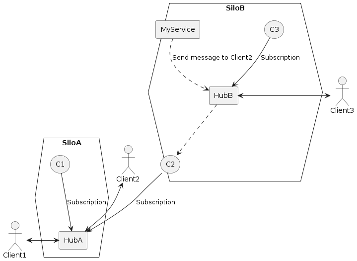
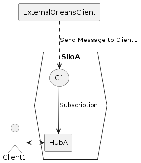

[](https://github.com/unifiedfx/UFX.Orleans.SignalRBackplane/actions/workflows/ci.yml)


# UFX.Orleans.SignalRBackplane

- [Overview](#overview)
- [Benefits](#benefits)
- [Usage](#usage)
  * [Adding the Backplane to an Orleans Silo](#adding-the-backplane-to-an-orleans-silo)
  * [Adding SignalR to the server](#adding-signalr-to-the-server)
  * [Sending messages to clients](#sending-messages-to-clients)
    + [Sending from the within the Orleans cluster](#sending-from-the-within-the-orleans-cluster)
    + [Sending from an external client](#sending-from-an-external-client)
  * [Serialization](#serialization)
    + [Passing JSON](#passing-json)
  * [Logging](#logging)
- [Sample Client and Server](#sample-client-and-server)
  * [Server](#server)
  * [SignalR Client](#signalr-client)
  * [Orleans Client](#orleans-client)
- [Design](#design)
  * [Graceful Disconnection](#graceful-disconnection)
  * [Silo Crash](#silo-crash)
- [Architecture](#architecture)
  * [Sending from the within the Orleans cluster](#sending-from-the-within-the-orleans-cluster-1)
  * [Sending from an external client](#sending-from-an-external-client-1)

# Overview
[Orleans](https://github.com/dotnet/orleans) is a framework that provides a straightforward approach to building distributed high-scale computing applications without the need to learn and apply complex concurrency or other scaling patterns.

[ASP.NET Core SignalR](https://github.com/aspnet/SignalR) is a library for ASP.NET Core that makes it incredibly simple to add real-time web functionality to your applications.
The ability to have your server-side code push content to the connected clients as it happens, in real-time with support for the following clients:

* [.Net](https://learn.microsoft.com/en-us/aspnet/core/signalr/dotnet-client?view=aspnetcore-7.0)
* [Java](https://learn.microsoft.com/en-us/aspnet/core/signalr/java-client?view=aspnetcore-7.0)
* [JavaScript](https://learn.microsoft.com/en-us/aspnet/core/signalr/javascript-client?view=aspnetcore-7.0)

This library is inspired by [SignalR.Orleans](https://github.com/OrleansContrib/SignalR.Orleans) and [Microsoft.AspNetCore.SignalR.StackExchangeRedis](https://www.nuget.org/packages/Microsoft.AspNetCore.SignalR.StackExchangeRedis/) and provides a [SignalR backplane](https://learn.microsoft.com/en-us/aspnet/signalr/overview/performance/scaleout-in-signalr) on top of Orleans, allowing scale-out to multiple servers with optimal performance and minimal dependencies.
This library supports Orleans V7 and uses Grain Observers as a PubSub mechanism.

# Benefits

* Ideal redundancy and scale-out compared to Redis due to co-hosting SignalR hubs with Orleans Silos.
* Eliminates the requirement for additional 3rd-party components to learn/scale and manage (i.e., Redis).
* Works with any supported Orleans storage provider: [ADO.NET](https://learn.microsoft.com/en-us/dotnet/orleans/grains/grain-persistence/relational-storage), [Azure Storage](https://learn.microsoft.com/en-us/dotnet/orleans/grains/grain-persistence/azure-storage), [Amazon DynamoDB](https://learn.microsoft.com/en-us/dotnet/orleans/grains/grain-persistence/dynamodb-storage) and [MongoDb](https://github.com/OrleansContrib/Orleans.Providers.MongoDB), among others.
* Other than configuring the Orleans Silo, there is no requirement to interact with Orleans directly. You can use the SignalR `IHubContext` directly, and messages will be sent across multiple servers if required.
* Minimal latency due to the direct server-to-server messaging using Grain Observers as a PubSub mechanism, as opposed to Orleans streams that work on a Store & Forward Queue.
* It can be used instead of [Azure SignalR Service](https://azure.microsoft.com/en-gb/products/signalr-service/#overview) scale-out, potentially saving thousands of dollars.

# Usage
## Adding the Backplane to an Orleans Silo
Install [UFX.Orleans.SignalRBackplane](https://www.nuget.org/packages/UFX.Orleans.SignalRBackplane) on the silo.

This is the minimum setup required to use this backplane:

```cs
builder.Host
    .UseOrleans(siloBuilder => siloBuilder
        .AddMemoryGrainStorage(UFX.Orleans.SignalRBackplane.Constants.StorageName)
        .UseInMemoryReminderService()
        .AddSignalRBackplane()
    );
```

`AddSignalRBackplane` will register reminder support on the silo if not already registered. You must provide reminder persistence using the `UseInMemoryReminderService()` extension (unsuitable for production), or a [persisted reminder storage provider](https://learn.microsoft.com/en-us/dotnet/orleans/grains/timers-and-reminders#configuration). 

You must also provide a named storage provider for the grains. We do not recommend memory storage for production. The name you must use is stored in the constant `UFX.Orleans.SignalRBackplane.Constants.StorageName`. This allows you to register a storage provider specific to the SignalR backplane, which can be a different storage provider to the rest of your application if preferred. You can see more detail on the persistence API [here](https://learn.microsoft.com/en-us/dotnet/orleans/grains/grain-persistence/?pivots=orleans-7-0#api).

You can use [any supported grain persistence](https://learn.microsoft.com/en-us/dotnet/orleans/grains/grain-persistence/?pivots=orleans-7-0#packages). For example, if you want to store our grains in Azure Blob storage, you can install the [Microsoft.Orleans.Persistence.AzureStorage](https://www.nuget.org/packages/Microsoft.Orleans.Persistence.AzureStorage) package, and change the above code to

```cs
builder.Host
    .UseOrleans(siloBuilder => siloBuilder
        .AddAzureBlobGrainStorage(UFX.Orleans.SignalRBackplane.Constants.StorageName, options => options.ConfigureBlobServiceClient(<yourBlobStorageConnectionString>))
        .UseInMemoryReminderService()
        .AddSignalRBackplane()
    );
```

### Using Fully Qualified Grain Types
Versions greater than v7.2.1 of this library fully qualify the grain type names to avoid grain type conflicts with grains from your own application. 

#### Existing deployments with v7.2.1 and below
Up to v7.2.1 of this library, if your own project contained any grain type names that are the same as a grain created by this library, such as `UserGrain`, then your silo would fail to start, because Orleans cannot differentiate between the two grain types.

If you have an existing deployment with v7.2.1 or earlier, and upgrade this library, **Fully Qualified Grain Types are considered a breaking change**, and you may experience issues as the grain type names will no longer be backwards compatible. If this is the case, you should set `UseFullyQualifiedGrainTypes` to false to keep the v7.2.1  behaviour of this library.

```cs
.AddSignalRBackplane(options => options.UseFullyQualifiedGrainTypes = false)
```

If you disable fully qualified grain types, you must ensure that your grain type names do not conflict with the grain types created by this library. This can be done by [decorating your own types](https://learn.microsoft.com/en-us/dotnet/orleans/grains/grain-identity#grain-type-names).

## Adding SignalR to the server
Adding this backplane does not register the SignalR services that are required to make real-time client-to-server and server-to-client possible. We leave this to you as there are a number of configurations you may want to make when doing this. For out-of-the-box configuration, you can call the `AddSignalR` extension on the `IServiceCollection`:

```cs
var builder = WebApplication.CreateBuilder(args);

builder.Services.AddSignalR();
```

You can then [further configure SignalR](https://learn.microsoft.com/en-us/aspnet/core/signalr/configuration?view=aspnetcore-7.0&tabs=dotnet) as required.

## Sending messages to clients
### Sending from the within the Orleans cluster
If you are sending a message from within the Orleans cluster, such as in a co-hosting scenario, you can use the `IHubContext` directly.

Once the services have been registered by following the section above, you can access an instance of `IHubContext<MyHub>` via dependency injection. Use the instance to send messages to clients. You can see more detail on the API [here](https://docs.microsoft.com/en-us/aspnet/core/signalr/hubcontext?view=aspnetcore-7.0).

```cs
public class MyService
{
    private readonly IHubContext<MyHub> _hubContext;

    public MyService(IHubContext<MyHub> hubContext)
      => _hubContext = hubContext;

    public Task SendMessage(string message)
       => await _hubContext.Clients.All.SendAsync("ReceiveMessage", message);
}
```

### Sending from an external client
If you need to send a message from an external client, you can use the [`UFX.Orleans.SignalRBackplane.Client`](https://www.nuget.org/packages/UFX.Orleans.SignalRBackplane.Client) package. This package provides an extension point to allow you to use an [Orleans Client](https://learn.microsoft.com/en-us/dotnet/orleans/host/client?pivots=orleans-7-0) to send messages to the SignalR backplane.

To add the external signalr hub service, you can call `AddSignalRHubContexts` on your silo client builder.

```cs
.UseOrleansClient(clientBuilder => clientBuilder  
  .AddSignalRHubContexts()
)
```

This will register both an `IExternalSignalrHubContextFactory` and a service resolver for typed contexts. This pattern will be familiar to anyone who has used Microsoft's `ILogger` and `ILoggerFactory`.

**If you have access to the hub type** from your client project, you can create an instance of the hub context either by resolving the hub context factory:

```cs
public MyService(IExternalSignalrHubContextFactory hubContextFactory)
  => _hubContext = hubContextFactory.CreateHubContext<MyHub>();
```
or simply injecting the typed context directly
```cs
public MyService(IExternalSignalrHubContext<MyHub> hubContext)
  => _hubContext = hubContext;
```

**If you do not have access to the hub type** from your client project, you must provide the hub name directly to the factory. Note that the name must be the [FullName](https://learn.microsoft.com/en-us/dotnet/api/system.type.fullname?f1url=%3FappId%3DDev16IDEF1%26l%3DEN-US%26k%3Dk(System.Type.FullName)%3Bk(SolutionItemsProject)%3Bk(DevLang-csharp)%26rd%3Dtrue&view=net-7.0) of the hub type, all in lowercase. You can can use the following to get an instance of the external hub context:

```cs
public MyService(IExternalSignalrHubContextFactory hubContextFactory)
  => _hubContext = hubContextFactory.CreateHubContext("myotherassembly.myhub");
```

Once you have an instance of the hub context, you can use it to send messages to clients. The API is very similar to an `IHubContext`.

## Serialization
Orleans v7 [introduced a version-tolerant serializer](https://learn.microsoft.com/en-us/dotnet/orleans/host/configuration-guide/serialization?pivots=orleans-7-0). The new serializer requires you to be explicit about which types and members are serialized. All types passed between grains must be serializable. 

You must mark all serializable types with the `[GenerateSerializer]` attribute. If serializing a class, all properties to be serialized must be marked with the `[Id(<order>)]` attribute. Record properties do not have this requirement when using a primary constructor, as each parameter has an implicit order. You can see an example of a serialized type in the `Shared` project within the `samples` folder.
* Types passed to `IClientProxy.SendAsync`, such as `Clients.Caller.SendAsync` must be serializable.
* Types passed to the Send methods on `IExternalSignalrHubContext` from an Orleans Client must be serializable by both the Client and Silo.

### Passing JSON
Note that if you do not strongly type the input to a hub method then the type of `message` would be `System.Text.Json.JsonElement`, if SignalR is using the default JSON format. The following example shows this scenario:

```cs
public class ChatHub : Hub
{
    public async Task SendToServer(object message)
    {
        await Clients.Caller.SendAsync("ReplyToClient", message);
    }
}
```

In this example, `message` is a `JsonElement` and so must be serializable as it is passed directly to `Clients.Caller.SendAsync`.

There are a few options for dealing with this:

* Change the hub method to receive a serializable type.
* Change the call to `SendAsync` to pass a serializable type, extracting any required data from `message`. The `message` argument can continue to stay as an `object` and therefore a `JsonElement`, or it could be any custom type. This custom type would not need to be serializable unless passed directly to `SendAsync`.
* Create your own [surrogate serializer](https://learn.microsoft.com/en-gb/dotnet/orleans/host/configuration-guide/serialization?pivots=orleans-7-0#surrogates-for-serializing-foreign-types) for `JsonElement` and pass `message` directly to `SendAsync`.
* [Enable JSON serialization on the silo](https://learn.microsoft.com/en-gb/dotnet/orleans/host/configuration-guide/serialization-configuration?pivots=orleans-7-0#configure-orleans-to-use-systemtextjson), which will allow `message` to be passed to `SendAsync`.

 If following the last option, the following code will enable silo JSON serialization **only** for the `JsonElement` type, which will allow all other types passed around between grains to continue using the new Orleans serializer.

```cs
siloBuilder.Services.AddSerializer(serializerBuilder =>
{
    serializerBuilder.AddJsonSerializer(
        isSupported: type => type == typeof(JsonElement)
    );
});
```

## Logging
All grains implement the `IIncomingGrainCallFilter` interface, which allows a log of all incoming calls to the grains. This is useful for debugging, as the grain type, method name called, address and id of the grain are all logged. This can be enabled by making sure the debug log level is active for the `UFX.Orleans.SignalRBackplane` namespace. One way to do this is to add the following to your `appsettings.json`:

```json
{
  "Logging": {
    "LogLevel": {
      "UFX.Orleans.SignalRBackplane": "Debug"
    }
  }
}
``` 

You can see other ways to configure the log level [here](https://learn.microsoft.com/en-us/aspnet/core/fundamentals/logging/?view=aspnetcore-7.0#set-log-level-by-command-line-environment-variables-and-other-configuration).

# Sample Client and Server
A sample SignalR client, Orleans client and Orleans silo are supplied in the `samples` folder. 
* The `Server` is a co-hosted ASP.NET Core app that uses the SignalR backplane and provides a single SignalR hub in the same process as the Silo. 
* The `SignalRClient` is a console application that connects to the server via SignalR and allows sending messages via command line input. On receipt of a message, the `ChatHub` on the server will add the caller to a group and then echo the message to the sender, to the group, and all connected clients.
* The `OrleansClient` is a console application that connects to the Silo and requests that a message is sent to all connections every 3 seconds.

## Server
The server runs on a random port each time to allow you to run multiple instances locally for multi-silo testing. The port can be found in the console output of the server. 

```
info: Microsoft.Hosting.Lifetime[14]
      Now listening on: https://127.0.0.1:62351
```

If you wish to run on the same port each time, you can change the `applicationUrl` in `Properties\launchSettings.json` to a fixed port rather than `:0`. You can then run the server via

```bash
\samples\Server> dotnet run
```

## SignalR Client
To run the client, use the following command. You must provide the port number that the server is running on. You can also give an optional number of SignalR connections to create from the client, which defaults to 1.

```bash
\samples\SignalRClient> dotnet run <server port number> [connection count]
```

## Orleans Client
To run the client, use the following command. There is no need to provide the port that the server is running on, as both the silo and client use [localhost clustering](https://learn.microsoft.com/en-us/dotnet/orleans/host/configuration-guide/local-development-configuration).

```bash
\samples\OrleansClient> dotnet run
```

# Design

Each connection, user, and group is represented by their own grain. When a new SignalR connection is made to a hub on a specific server, a connection grain is created, which can live on any silo. The hub then subscribes to the connection grain, which acts as a point of pub-sub communication. When a message is sent to a connection via the `IHubContext` on any server, the connection grain is called, which notifies the hub on the correct server that it should send the message to its local connection.

If the connection has a user identifier associated with it, then the hub will also subscribe to the user grain. When a message is sent to a user via the `IHubContext`, the user grain is called, which in turn notifies all of the hubs that have connections for that user, and they send out the message. The same mechanism is used for groups.

There is also a single HubGrain per hub type, that all hubs of that type subscribe to. This allows the sending of messages to all connections on all hubs of that type. 

This design reduces the number of network requests between silos, using the Orleans grain directory to locate grains and the observer pattern to notify the correct hub of messages.

## Graceful Disconnection
Hubs track their connections and which users and groups these connections are members of. When a connection is disconnected, the hub unsubscribes from the connection grain. All grains have an in-built mechanism whereby they delete their state and deactivate when their last observer unsubscribes. This allows group and user subscriptions to be removed when the last connection for that user or group is removed.

When a silo is shutdown gracefully, all of the connections on that silo are deactivated, and the same mechanism is used to remove the subscriptions.

## Silo Crash
If a silo is stopped before it has a chance to gracefully shutdown, then the grains will remain active. In this scenario, there may be grains that will never be invoked again, because they represent connections/groups/users that no longer exist. To cater for this, every grain will periodically ping its subscribers to check they are still alive. Any defunct observers are removed from the grain's state, and the grain will clear all its state and deactivate if it has no more observers.

This ping period is configurable, and is one day by default. There is a trade-off here between persistence storage and cpu/network/memory usage. A short period will mean grains clean up their state quickly, reducing the amount of persistent storage used bvy defunct grains. However, it will also mean that more network requests are made to check the status of observers and more cpu and memory used to reactivate the grains. A longer period will mean fewer network requests made and grains reactivated less frequently, but more persistent storage may be used by defunct grains.

If you would like to customise the cleanup period, use the `GrainCleanupPeriod` property on the `SignalrOrleansOptions` class.
```cs
.AddSignalRBackplane(x => x.GrainCleanupPeriod = TimeSpan.FromHours(1))
```

# Architecture
## Sending from the within the Orleans cluster

## Sending from an external client

