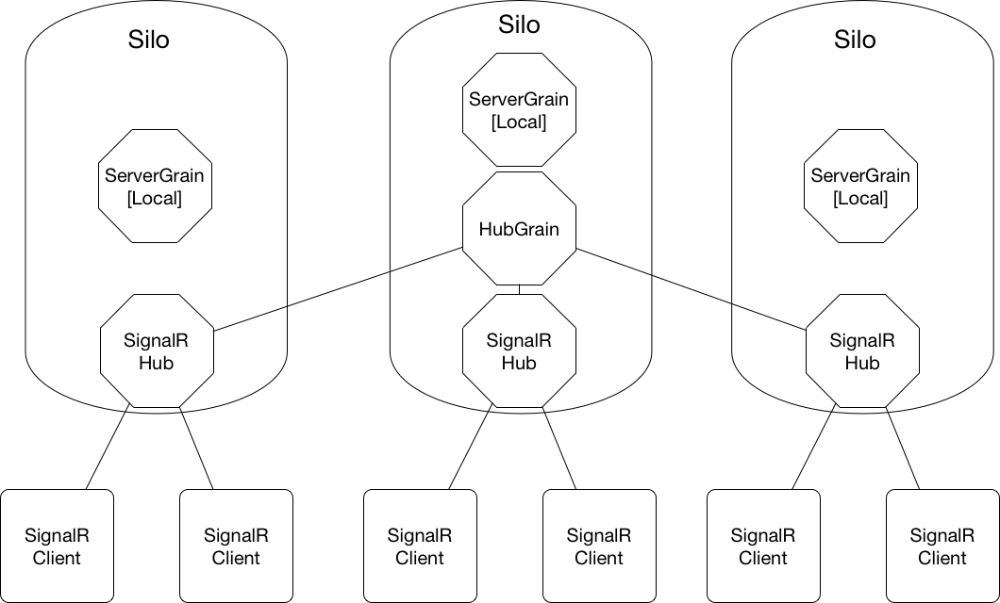

# UFX.Orleans.SignalR

[Orleans](https://github.com/dotnet/orleans) is a framework that provides a straight-forward approach to building distributed high-scale computing applications,
without the need to learn and apply complex concurrency or other scaling patterns.

[ASP.NET Core SignalR](https://github.com/aspnet/SignalR) is a library for ASP.NET Core that makes it incredibly simple to add real-time web functionality to your applications.
The ability to have your server-side code push content to the connected clients as it happens, in real-time with support for the following clients:

* [.Net](https://learn.microsoft.com/en-us/aspnet/core/signalr/dotnet-client?view=aspnetcore-7.0)
* [Java](https://learn.microsoft.com/en-us/aspnet/core/signalr/java-client?view=aspnetcore-7.0)
* [JavaScript](https://learn.microsoft.com/en-us/aspnet/core/signalr/javascript-client?view=aspnetcore-7.0)

This library is inspired by [SignalR.Orleans](https://github.com/OrleansContrib/SignalR.Orleans) and [Microsoft.AspNetCore.SignalR.StackExchangeRedis](https://www.nuget.org/packages/Microsoft.AspNetCore.SignalR.StackExchangeRedis/) and provides SignalR scale-out to multiple servers with optimal performance and minimal dependencies.
This library supports Orleans V7 and approaches the scale-out from a different perspective as follows:

* Groups and Users tracked at Server instead of Connection level given that connections only ever exist against a particular server
* Ideal redundancy and scale-out compared to Redis due to co-hosting SignalR hubs with Orleans Silos
* Eliminates the requirement for additional 3rd-party components to learn/scale and manage (i.e. Redis)
* Works with any supported Orleans storage provider: [ADO.NET](https://learn.microsoft.com/en-us/dotnet/orleans/grains/grain-persistence/relational-storage), [Azure](https://learn.microsoft.com/en-us/dotnet/orleans/grains/grain-persistence/azure-storage), [Amazon DynamoDB](https://learn.microsoft.com/en-us/dotnet/orleans/grains/grain-persistence/dynamodb-storage) & [MongoDb](https://github.com/OrleansContrib/Orleans.Providers.MongoDB) among others
* Other than configuring the Orleans Silo, no requirement to interact with Orleans directly, simply use the SignalR **IHubContext** directly and messages will be sent across multiple servers if required.
* Significant reduction of Group/User membership traffic on the basis that non-local connection specific requests will in most situations be lower than add/remove connection messages
* Minimal latency due to direct server to server messaging using IGrainObserver as opposed to Orleans streams that work on a Store & Forward Queue
* Can be used instead of [Azure SignalR Service](https://azure.microsoft.com/en-gb/products/signalr-service/#overview) scale-out, potentially saving thousands of dollars

# Overview

Each SignalR hub instance terminates connections locally, then for each Join/Leave Group or User Connect/Disconnect event the server gets added or removed to/from the HubGrain.
The HubGrain maintains group/user membership of all servers the following are examples of how different kinds of messages are handled:

* Sending messages to all connections the requesting server obtains a list of all servers from the HubGrain and sends the message directly to each server.
* Sending a message to a Group/User the source server retrieves a list of servers that have that Group/User and sends the message to all relevant servers directly.
* Sending per connection level messages the hub checks to see if the connection is local and handles locally, if the connection is not on the local server then the request is sent to all other servers. Each server then checks its local connection and handles if required, otherwise the request is ignored if no local connection for the request.

### ServerGrain

The ServerGrain's primary responsibility is sending messages to the local connection(s) where relevant, the ServerGrain uses **PreferLocalPlacement** and calls **DeactivateOnIdle()** if the local (HubLifetimeManager) has not subscribed,
this should ensure that the server grain activations are local to the corresponding connections ensuring minimal network traffic.

### HubGrain
The HubGrain periodically calls each ServerGrain's **CheckSubscriber()** method and if there is no HubLifetimeManager subscribed the server is removed from all Group/User memberships.
When a SignalR server instance comes online it's HubLifetimeManager subscribes to the corresponding ServerGrain on the first client connection.
This permits servers to dynamically come online/offline as required making Scale-out ver simple allowing for increased capacity just by standing up additional servers.
This is perfectly compliments Azure App Service with only a single item requiring scaleout

### Diagram

# Considerations

As with any implementation there are pros and cons to the choices made, in the case of this library it works optimally if requests are send to Groups/Users instead of maintaining separate lists of connectionId and sending to specific connections.
This library could be extended to add ConnectionGrains to improve per connection message efficiency, however utilising the existing Group/User membership mitigates this.

This initial implementation uses Grain Persistence and a simple server health check (from the HubGrain).
It should be possible to remove the need for grain persistence and have each server re-publish its full Group/User state on-demand (i.e. HubGrain re-activation)

